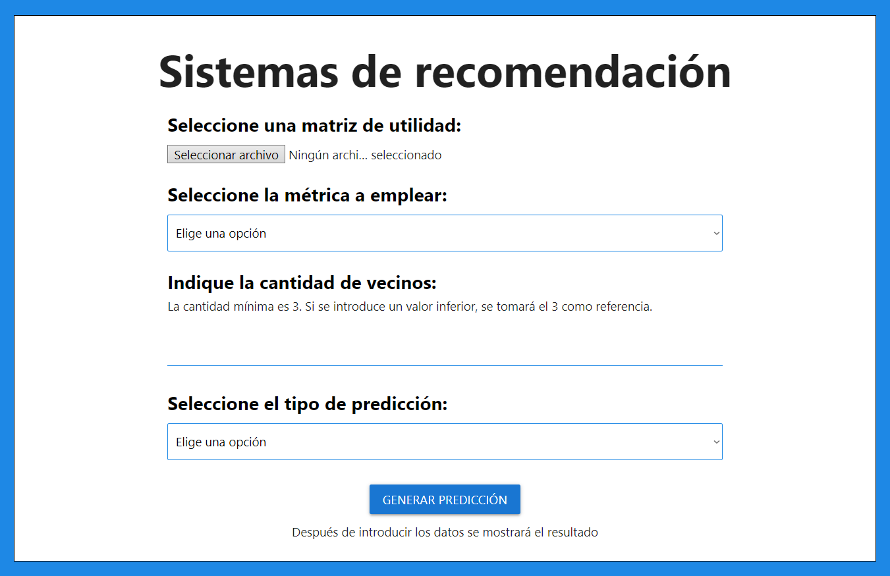
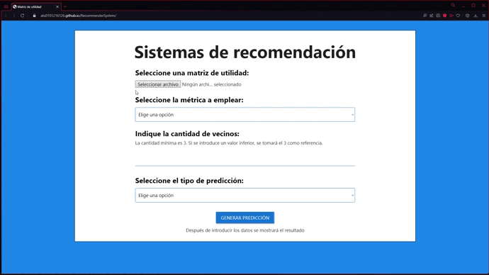

<a name="item0"></a>
# RecommenderSystem

#### Autor: Daniel Álvarez Medina
#### Correo: alu0101216126@ull.edu.es
#### [Acceda al sistema de recomendación](https://alu0101216126.github.io/RecommenderSystem/)

## Índice

* [Introducción](#item1)
* [Directorios](#item2)
* [Instrucciones](#item3)
* [Descripción del código](#item4)

  * [index.html](#item4.1) 
  * [form.js](#item4.2)
  * [recommender.js](#item4.3) 

<a name="item1"></a>
## 1. Introducción

Implementación de un sistema de recomendación siguiendo el sistema de filtrado colaborativo.

La práctica se ha llevado a cabo en el lenguaje **Javascript**. A su vez, la pedida de datos la hemos realizado en HTML y procesado posteriormente en Javascript.
Cabe destacar que para dar estilo al HTML, empleamos hojas de estilo **CSS**, y también las proporcionadas por el framework de CSS [Materialize](https://materializecss.com).

[↑](#item0)

<a name="item2"></a>
## 2. Directorios

Si accedemos al directorio [/docs](https://github.com/alu0101216126/RecommenderSystem/tree/main/docs), encontraremos una organización como la siguiente:

* [/css](https://github.com/alu0101216126/RecommenderSystem/tree/main/docs/css): Directorio que contiene las hojas de estilo empleadas. 
  * [style.css](https://github.com/alu0101216126/RecommenderSystem/blob/main/docs/css/style.css): Hoja de estilo para el archivo [index.html](https://github.com/alu0101216126/RecommenderSystem/blob/main/docs/index.html)

* [/examples](https://github.com/alu0101216126/RecommenderSystem/tree/main/docs/examples): Directorio que contiene una serie de matrices de utilidad de ejemplo para introducir en el sistema de recomendación.
  * [utility-matrix-10-25-1.txt](https://github.com/alu0101216126/RecommenderSystem/blob/main/docs/examples/utility-matrix-10-25-1.txt): Ejemplo de matriz de 10x25.
  * [utility-matrix-10-25-2.txt](https://github.com/alu0101216126/RecommenderSystem/blob/main/docs/examples/utility-matrix-10-25-2.txt): Ejemplo de matriz de 10x25.
  * [utility-matrix-10-25-9.txt](https://github.com/alu0101216126/RecommenderSystem/blob/main/docs/examples/utility-matrix-10-25-9.txt): Ejemplo de matriz de 10x25.
  * [utility-matrix-100-1000-1.txt](https://github.com/alu0101216126/RecommenderSystem/blob/main/docs/examples/utility-matrix-100-1000-1.txt): Ejemplo de matriz de 100x1000.
  * [utility-matrix-25-100-1.txt](https://github.com/alu0101216126/RecommenderSystem/blob/main/docs/examples/utility-matrix-25-100-1.txt): Ejemplo de matriz de 25x100.
  * [utility-matrix-5-10-4.txt](https://github.com/alu0101216126/RecommenderSystem/blob/main/docs/examples/utility-matrix-5-10-4.txt): Ejemplo de matriz de 5x10.
  * [utility-matrix-5-5-1.txt](https://github.com/alu0101216126/RecommenderSystem/blob/main/docs/examples/utility-matrix-5-5-1.txt): Ejemplo de matriz de 5x5.

* [/media](https://github.com/alu0101216126/RecommenderSystem/tree/main/docs/media): Directorio que contiene imágenes y gifs empleados en el README.md.
* [/src](https://github.com/alu0101216126/RecommenderSystem/tree/main/docs/src): Directorio que contiene los scripts empleados para llevar a cabo el sistema de recomendación
  * [form.js](https://github.com/alu0101216126/RecommenderSystem/blob/main/docs/src/form.js): Procesamos los datos obtenidos en el formulario, y mediante un objeto de la clase **Recommender**, obtenemos y mostramos los resultados.
  * [recommender.js](https://github.com/alu0101216126/RecommenderSystem/blob/main/docs/src/recommender.js): Contiene la clase **Recommender**, dicha clase almacena los datos obtenidos en el formulario y realiza los cálculos correspondientes para obtener: la matriz de utilidad con las predicciones, la matriz de similitud, los vecinos más optimos para cada item de algún usuario, y los cálculos realizados en las predicciones.
* [index.html](https://github.com/alu0101216126/RecommenderSystem/blob/main/docs/index.html): Fichero **HTML** que contiene el formulario a procesar mediante el fichero [form.js](https://github.com/alu0101216126/RecommenderSystem/blob/main/docs/src/form.js)

[↑](#item0)

<a name="item3"></a>
## 3. Instrucciones

Para acceder al sistema recomendador lo haremos a través del enlace que aparece en la parte superior, o haciendo clic [aquí](https://alu0101216126.github.io/RecommenderSystem/).



Veremos que tenemos un formulario con una serie de campos:

* En primer lugar, se nos indica que seleccionemos una matriz de utilidad. Dicha matriz la debemos de subir en formato `.txt`, al pusar el botón de **Seleccionar arhivo**. En [/examples](https://github.com/alu0101216126/RecommenderSystem/tree/main/docs/examples) podemos encontrar algunas matrices de ejemplo. 
* Posteriormente debemos de seleccionar la métrica a emplear, tenemos tres opciones:

  * Correlación de Pearson
  * Distancia Coseno
  * Distancia Euclídea 

* A continuación elegimos la cantidad de vecinos, donde la cantidad mínima es 3. Si se introduce un valor inferior, se tomará el 3 como referencia.
* Finalmente debemos de elegir el tipo de predicción, donde puede ser:
  
  * Predicción simple
  * Diferencia con la media 

Una vez seleccionado todos los campos, pulsaremos el botón de **GENERAR PREDICCIÓN** para mostrar los resultados.

Un ejemplo de ejecución sería el siguiente:

<p align="center">
 <a href="https://github.com/alu0101216126/RecommenderSystem/blob/main/docs/media/formExample.gif">
  
 </a>
</p>

[↑](#item0)

<a name="item4"></a>
## 4. Descripción del código

<a name="item4.1"></a>
### 4.1. index.html

El fichero [index.html](https://github.com/alu0101216126/RecommenderSystem/blob/main/docs/index.html), contiene el formulario a rellenar por parte del usuario, donde posteriormente será analizado.

La información del contenido de este fichero lo puede encontrar en las [Instrucciones](#item3). 

[↑](#item0)

<a name="item4.2"></a>
### 4.2. form.js

En [form.js](https://github.com/alu0101216126/RecommenderSystem/blob/main/docs/src/form.js), procesamos los datos obtenidos en el formulario, para posteriormente almacenarlos en variables, y mediante un objeto de la clase **Recommender**, obtener y mostrar los resultados.

Para esto, primeramente, creamos un objeto de la clase Recommender que explicaremos más adelante. Lo llamaremos **recommender**:
```javascript
const recommender = new Recommender();
```
Una vez creado el objeto, podremos trabajar con los eventos para procesar y mostrar datos. Para conseguir esto, empleamos dos tipos de eventos:

* Evento `change`: Este evento se activará cada vez que el input del campo que estamos observando cambie.

```javascript
const metrics = document.getElementById('metrics');
metrics.addEventListener('change', function(e) {
    recommender.setMetrics(e.target.value);
});
```
Se puede observar en el ejemplo, que lo que haremos será obtener el campo que queremos analizar, que en este caso es la métrica a elegir. Posteriormente, cuando se active el evento, mediante el objeto recommender, almacenaremos el valor introducido. Esto aplicaría a todos los eventos que usan `change`.

El caso más complejo en este caso, es al obtener la matriz mediante fichero. Lo que debemos de hacer en este caso es transformar dicho fichero a formato de matriz de números. 

Para ello creamos la función `fileToMatrix`. Aquí creamos un objeto de la clase `FileReader()` que denominaremos `reader`. Una vez hecho esto, leemos el fichero recibido como texto:

```javascript
    const file = fileInput.files[0];
    let reader = new FileReader();
    let matrix = [];
    reader.readAsText(file);
```
Cuando se acabe de leer el fichero correctamente, se activará el evento `load`. En este evento tranformaremos los datos para crear una matriz de números, y cambiaremos los '-' por el valor -1. Finalmente esta matriz se almacena en el objeto recommender.

* Evento `click`: Este evento se activará cada vez que pulsemos el botón del campo que estamos observando.

```javascript
const generate = document.getElementById('generate');
generate.addEventListener('click', function(e) {
```
Se puede observar en el ejemplo, que lo que haremos será obtener el campo que queremos analizar, que en este caso es el botón a pulsar. Posteriormente, cuando se active el evento, lo que haremos será realizar todos los cálculos con los valores almacenados hasta el momento, para finalmente mostrarlos.

[↑](#item0)

<a name="item4.3"></a>
### 4.3. recommender.js

El fichero [recommender.js](https://github.com/alu0101216126/RecommenderSystem/blob/main/docs/src/recommender.js), contiene la clase **Recommender**, dicha clase almacena los datos obtenidos en el formulario y realiza los cálculos correspondientes para obtener: la matriz de utilidad con las predicciones, la matriz de similitud, los vecinos más optimos para cada item de algún usuario, y los cálculos realizados en las predicciones.

#### **_Constructor_**

El constructor por defecto de la clase es el siguiente:

```javascript
constructor() {
        this.matrix = [];
        this.transformedMatrix = [];
        this.similarityMatrix = [];
        this.neighborsPerUser = [];
        this.calculatePredictions = [];
        this.neighbors = 3; // Mínimo 3 vecinos
        this.prediction = '1';
        this.metrics = '1';  
      }
```
Como los valores de los atributos cambian dinámicamente mediante el evento explicado `change`, todos los atributos tendrán valores por defecto hasta que estos cambien.

* `this.matrix`: Matriz de utilidad que contiene un -1 en aquellos items que no han sido calificados.
* `this.transformedMatrix`: Matriz de utilidad que contiene los resultados de los cálculos de predicciones realizados en aquellos items sin calificación.
* `this.similarityMatrix`: Matriz de similitud entre los usuarios. Basada en la métrica empleada
* `this.neighborsPerUser`: Array de array de tipo `[[usuario, item, vecinos], ...]`. Almacena los vecinos más óptimos para cada item, especificando su usuario. Cabe destacar que `vecinos` contiene los vecinos óptimos.
* `this.calculatePredictions`: Array de array que almacenará los cálculos de predicción realizados.

  * En el caso de predicción simple, el formato es: `[[usuario, item, numerador, denominador, resultado], ...]`
  * En el caso de predicción basada en diferencia con la media, el formato es: `[[usuario, item, numerador, denominador, resultado, media del usuario], ...]`
  
* `this.neighbors`: Cantidad de vecinos a considerar. Mínimo debe de ser 3.
* `this.prediction`: Indica la predicción a emplear. `'1' = Predicción simple`, `'2' = Predicción basada en la diferencia con la media`
* `this.metrics`: Indica la métrica a emplear. `'1' = Correlación de Pearson`,` '2' = Distancia coseno`,` '3' = Distancia Euclídea`

